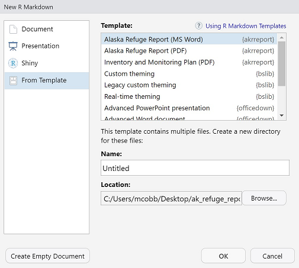

---
output:
  md_document:
    variant: gfm
---

```{r, include = FALSE}
knitr::opts_chunk$set(message = FALSE)
```


# USFWS Disclaimer
This United States Fish & Wildlife Service (USFWS) code is provided on an "as is" basis and the user assumes responsibility for its use.  USFWS has relinquished control of the information and no longer has responsibility to protect the integrity , confidentiality, or availability of the information.  Any reference to specific commercial products, processes, or services by service mark, trademark, manufacturer, or otherwise, does not constitute or imply their endorsement, recomendation or favoring by USFWS.  The USFWS seal and logo shall not be used in any manner to imply endorsement of any commercial product or activity by USFWS or the United States Government. 

# Alaska Refuge Report

This package provides a R Markdown template for Alaska National Wildlife Refuge Reports.

## Installing akrreport

To use `akrreport` and generate the pdf Project Reports from the template, you'll need:

1. **R version >4.0** Available through FWS Apps-to-Go
1. **Rtools version >4.0** Available through FWS Apps-to-Go
1. **TeX** Install `tinytex` in R using the following commands and following the onscreen prompts: 

    ```{r, eval = FALSE}
    install.packages("tinytex")
    tinytex::install_tinytex()
    ```


## Installing the Template

Install the template directly:

```{r, eval = FALSE}
if (!requireNamespace("devtools")) install.packages("devtools")
devtools::install_github("usfws/akrreport")
```

This will install the package `akrreport`. Once installed, the template will be available within the R Markdown templates as shown below:

