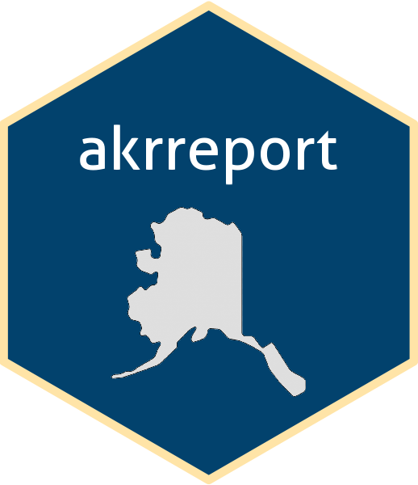

<!-- README.md is generated from README.Rmd. Please edit that file -->

```{r, echo = FALSE}
knitr::opts_chunk$set(
  collapse = TRUE,
  comment = "#>",
  fig.path = "man/figures/README-"
)
```

# akrreport <a href=""></a>

<!-- badges: start -->
[](https://lifecycle.r-lib.org/articles/stages.html#experimental)
[](https://github.com/USFWS/akrreport/actions/workflows/R-CMD-check.yaml)
<!-- badges: end -->

## Overview

This R package provides R Markdown and Quarto templates for reports generated by biologists at National Wildlife Refuges in Alaska, including the Alaska Refuge Report Series.

## Installation

To use `akrreport` and generate Word or PDF reports from a template, you'll need:

1. **R version >4.0** Available through FWS Apps-to-Go
1. **Rtools version >4.0** Available through FWS Apps-to-Go
1. **TeX** Install `tinytex` in R using the following commands and following the onscreen prompts: 

    ```{r, eval = FALSE}
    install.packages("tinytex")
    tinytex::install_tinytex()
    ```


## Usage

Install the template directly:

```{r, eval = FALSE}
if (!requireNamespace("devtools")) install.packages("devtools")
devtools::install_github("usfws/akrreport")
```

This will install the package `akrreport`. Once installed, templates will be available within the R Markdown and Quarto templates as shown below:


## Getting help

Contact the [project maintainer](emailto:mccrea_cobb@fws.gov) for help with this repository.

## Contribute

Contact the [project maintainer](emailto:mccrea_cobb@fws.gov) for information about contributing to this repository template. Submit a [GitHub Issue](https://github.com/USFWS/r7-repo-template/issues) to report a bug or request a feature or enhancement.

-----

 This work is
licensed under a [Creative Commons Attribution 1.0 International
License](https://creativecommons.org/licenses/by/1.0/).