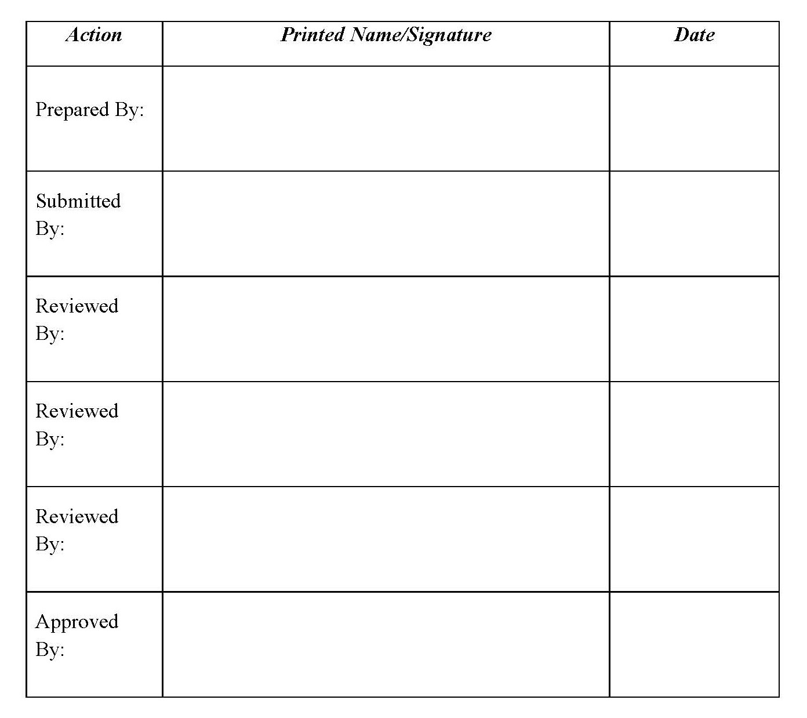

***

&nbsp; <!-- generates horizontal spacing -->

&nbsp; <!-- generates horizontal spacing -->

&nbsp; <!-- generates horizontal spacing -->

\begin{center}

```{r cover_photo, out.width = "90%", fig.pos="h", echo=F}
knitr::include_graphics("images/View_LowerRedRockLake.jpg")
```

```{r setup, include=FALSE}
## Set global chunk options
knitr::opts_chunk$set(echo = FALSE, 
                      message = FALSE, 
                      warning = FALSE, 
                      fig.pos="h", 
                      results='as.is')

## Install necessary R packages
library(kableExtra)
library(bookdown)

################################################################
## Report date; used in annual report summaries at end of IMP ##
##                     UPDATE EACH YEAR                       ##
################################################################
report.year <- 2020

###########################################################
## Refuge-specific variables that are unlikely to change ##
###########################################################
## Refuge name (for automated captions; do not include 'National Wildlife Refuge')
refuge.name <- "The Refuge "

## Number of surveys included in the IMP
nsurv <- 7
nsurv2 <- "seven"

## Date report was knitted; used in Table 1 caption (updates automatically, no need to change)
report.date <- format(Sys.Date(), "%m/%d/%Y")

```

\end{center}
\newpage

# Signature Page
```{r signature_page}

```

\newpage
\tableofcontents
\newpage


# Introduction 

This Inventory and Monitoring Plan (IMP) outlines natural resource surveys that will be conducted at `r refuge.name` National Wildlife Refuge (NWR) within the **XXX** Complex. The plan is valid for 15 years from the approval date and may be amended if the Refuge's Comprehensive Conservation Plan (CCP) is updated and/or a Habitat Management Plan (HMP) is completed, or if another need for revision is identified. Selected surveys have been identified as necessary for achieving the Refuge mission and informing management of priority habitats and/or species. Selected surveys may be ongoing surveys that 1) estimate a resource of concern's (ROC) current state for state-dependent management, 2) improve understanding of ROC response to management, or 3) are part of a regional and/or national survey effort. This IMP was developed according to the Inventory and Monitoring (I&M) policy (701 FW 2) for the National Wildlife Refuge System. 

## Refuge Establishment

Insert establishment authority or explanation from CCP

For more information about the Refuge’s history, purpose and resources, please see please `r refuge.name` NWR’s CCP [https://ecos.fws.gov/ServCat/DownloadFile/8142](https://ecos.fws.gov/ServCat/DownloadFile/8142) and/or website [https://www.fws.gov/refuge/red_rock_lakes/](https://www.fws.gov/refuge/red_rock_lakes/). 

# Methods 

The Refuge participated in an evaluation process to identify and prioritize all current, planned, expected, or desired surveys. Below is an outline of the survey prioritization and selection process. 

* Refuge staff identified the top **X** biological priorities for `r refuge.name` NWR and reviewed existing CCP objectives[^1] (Appendix I) to ensure they were specific, measurable, achievable, realistic and time-bound (SMART). Identifying the Refuge's biological priorities facilitates appropriate annual planning to ensure the complete workflow for priority surveys, from data collection to informing management decisions, can be completed with existing staff capacity.

* All current, planned, expected, or desired surveys are identified. Refuge staff summarized background information for each survey prior to prioritization. The Zone Biologist facilitated a one-day workshop ***Date*** to prioritize and rank all listed surveys. Participants included:                  	
	 
* Surveys are ranked and prioritized into *Selected*, *Non-selected* or *Future*.
    * **Selected**: High priority surveys that are included in the IMP.
    * **Non-selected**: Surveys that: 
        * Have been completed;
        * Are not expected to meet National I&M policy goals of protocol development, data analysis and reporting;
        * Are conducted to assist cooperators with data collection, but where the cooperator is not expected to develop a protocol or provide information to the Refuge.
    * **Future**[^2]: Priority surveys that need: 
        * Significant additional resources not currently available;
        * Conceptual development to provide objectives linked to management priorities or efforts;
        * Partner development and contribution. 

* Selected surveys are categorized as either “current” or “expected”
    * **Current**: surveys that are highest priority I&M projects for the Refuge and are **currently conducted and have sufficient support for completion**. These surveys are the most applicable to Refuge goals and objectives. In addition, they were likely to assist many partners of the Refuge and provide assistance in landscape management.
    * **Expected**: surveys that have not yet started but have a start date within the life of the IMP as the resources necessary to complete these surveys have been identified.

* **Estimating Capacity** 
    * The staff time or dollars required to complete a survey are roughly estimated using the IMP workbook (Table 1). These estimates should be considered draft; exact values or cost estimates were not entered into PRIMR. Staff time for selected surveys were estimated based on the amount of time spent to plan, collect, analyze and use data (i.e., development of habitat management prescriptions). Costs were estimated by evaluating potential contracts, equipment, and travel accommodations that could be required each year. 

[^1]: Objectives for regional- and national-level surveys were not reviewed during this process.
[^2]: Future surveys are ranked sequentially with selected surveys with the expectation that resources sufficient to complete them could become available during the lifespan of the IMP.

# Results
 
There were `r nsurv2` priority surveys selected for this IMP. Table 1 was created using PRIMR records for selected surveys, providing essential information for each selected survey. The survey narratives provide an in depth justification, explaining the importance and purpose of each survey. 

\newpage
\blandscape

```{r table_1}
##########################################################################
## IMP Table 1; update each of the parameters below to complete Table 1 ##
##########################################################################
## Columns are: 
# 1) Survey Priority, 2) Survey ID Number, 3) Survey Name/Type, 4) Survey Status, 5) Survey Objective, 6) Survey Area, 
# 7) Staff Time (FTE), 8) Average Annual Cost, 9) Survey Timing, 10) Survey Length, 11) Survey Coordinator, 
# 12) Protocol Citation and 13) Protocol Status
#################
# Change priority to match the number of priorities identified by station
priority <- 1:nsurv 

# Survey identification number (where do these come from? ServCat?)
id.number <- rep("XXX",nsurv) 

# Survey types are: I = inventory, M = monitoring, R = research, CM = cooperative monitoring, CR = cooperative research
name.type <- c("4-square Mile Survey (CM)", "Water Quality Monitoring (M)", "Native Prairie Adaptive Management (CR)", "Grassland Monitoring (M)", "Wetland State-and-Transition Model Monitoring (M)",  "PFW Bird Survey (CM)", "Duck Banding (CM)") 

# Survey status are: C = current, E = expected, F = future, H = historic
status <- c(rep("Current",nsurv-4),"Expected",rep("Current",nsurv-4))

# Where are the survey objectives documented? E.g., CCP, HMP, other plan/document.
objectives <- rep("CCP?",nsurv)
  
# What is the area surveyed for each survey?
area <- c("Phillips County","Entire Station","Entire Station","Entire Station","Entire Station","Phillips County","Entire Station")

# Staff time, measured as full-time equivalent, for each survey and cooperator (don't have the latter included yet)
fte <- c(0.1, 0.15, 0.1, 0.35, 0.25, 0.01, 0.1) #estimated FTE for each survey
fws.fte <- c(paste0(rep("FWS: ", nsurv), fte))
  
# Average annual cost for each survey
cost.1 <- c("2,500","5,000","5,000","10,000","7,500","750","5,000")
cost <- c(paste0(rep("\\$",nsurv), cost.1))

# Survey timing 
timing <- c("May","June-September", "June-August","June-August","July-August","May","September")

# Survey length, i.e., beginning and ending year for each survey
length <- rep("2020-indefinite",nsurv)

# Survey coordinator
coordinator <- rep("Refuge Biologist",nsurv)

# Protocol citation
p.cite <- rep("?", nsurv)

# Protocol status
p.status <- rep("Initial Survey Instructions", nsurv)

# Combine the vectors created above into a dataframe that will be Table 1
table1 <- data.frame(priority, id.number, name.type, status, objectives, area, fws.fte, cost, timing, length, coordinator, p.cite, p.status)#fws.fte

# Table 1 names
table1.names <- c("Survey\n Priority\\textsuperscript{1}","Survey ID\n Number\\textsuperscript{2}", "Survey Name/\n Type\\textsuperscript{3}", "Survey\n Status\\textsuperscript{4}","Survey\n Objective\\textsuperscript{5}","Survey Area\\textsuperscript{6}", "Staff Time (FTE)\\textsuperscript{7}","Avg. Ann. Cost\\textsuperscript{8}","Survey Timing\\textsuperscript{9}","Survey Length\\textsuperscript{10}","Survey Coord.\\textsuperscript{11}","Protocol Citation\\textsuperscript{12}","Protocol Status\\textsuperscript{13}") # \n can be placed in a column name to force a return, e.g. "Survey\n Area"

# Table 1 caption
table.caption <- paste("IMP Selected Surveys: ", refuge.name, " National Wildlife Refuge. Report generated on ", report.date, ".", sep="")

# Table 1, including footnotes
table1 %>%
  kable(., "latex", booktabs = T, caption=table.caption, col.names=table1.names, escape=F, align="c") %>%
  column_spec(1:13, width = c("0.35in", "0.4in", "0.65in", "0.325in", "0.5in", "0.75in", "0.325in","0.325in", rep("0.5in",5))) %>%
  kable_styling(latex_options = "striped", font_size = 7) %>%
  add_footnote(c("The rank for each survey listed in order of priority.", "A unique identification number consisting of refuge code (FBMS cost center identifier) and a computer assigned sequential number.", "Short titles for survey name and PRIMR survey type (Inventory (I), Cooperative Baseline Monitoring (CB), Monitoring to Inform Management (M),\n Cooperative Monitoring to Inform Management (CM), Research (R), and Cooperative Research (CR).", "Surveys selected for lifespan of IMP.", "Management plan and objectives that justify selected survey.", "Names of units included in survey; includes refuge management units, entire refuge, or other landscape units", "Estimates of Service (FWS) and non-Service (Other) staff time needed to complete survey (1 work year =2080 hrs = 1 FTE).", "Estimates of average annual operations cost for conducting the survey (e.g., equipment, contracts, travel); excluding staff time.", "Timing and frequency of survey field activities.", "Years survey conducted.", "Name and position of survey coordinator (Refuge Biologist or other designated Service employee).", "Title, author, and version of survey protocol ('None' if no protocol).", "Protocol stage of approval (Initial Survey Instructions, Complete Draft, In Review,\n or Approved)."), notation="number") 

```

\elandscape

\newpage

```{r decision_tree, out.width="100%", echo=F, fig.cap="Decision tree used to determine if a) monitoring is warranted, and b) what type of monitoring to undertake (from McDonald-Madden et al. 2010)."}
knitr::include_graphics("MdDonald-Madden_2010_decisiontree.png")
```


# Survey Narratives

##*1. Monitoring... (PRIMR ID: ###-###)*

>**1.	What is the population or attribute of interest, and what will be measured, and when?**


>**2.	What refuge management goals and objective(s) does the survey support? Is/are the goal(s) or objective(s) derived from the CCP, interim objectives, an HMP, or the biological priorities? What strategies or strategy does the survey inform?**


>**3.	Why is it important to conduct the survey? Describe how the survey results will be used to make better informed refuge management decisions. If survey results are used to trigger a management response, identify the management response and threshold value for comparison to survey results.**


>**4.	Is this a cooperative survey? If so, what partners are involved in the survey?**


##*2. Monitoring... (PRIMR ID: ###-###)*

>**1.	What is the population or attribute of interest, and what will be measured, and when?**


>**2.	What refuge management goals and objective(s) does the survey support? Is/are the goal(s) or objective(s) derived from the CCP, interim objectives, an HMP, or the biological priorities? What strategies or strategy does the survey inform?**


>**3.	Why is it important to conduct the survey? Describe how the survey results will be used to make better informed refuge management decisions. If survey results are used to trigger a management response, identify the management response and threshold value for comparison to survey results.**


>**4.	Is this a cooperative survey? If so, what partners are involved in the survey?**

##*3. Monitoring... (PRIMR ID: ###-###)*

>**1.	What is the population or attribute of interest, and what will be measured, and when?**


>**2.	What refuge management goals and objective(s) does the survey support? Is/are the goal(s) or objective(s) derived from the CCP, interim objectives, an HMP, or the biological priorities? What strategies or strategy does the survey inform?**


>**3.	Why is it important to conduct the survey? Describe how the survey results will be used to make better informed refuge management decisions. If survey results are used to trigger a management response, identify the management response and threshold value for comparison to survey results.**


>**4.	Is this a cooperative survey? If so, what partners are involved in the survey?**

\newpage

# References

McDonald-Madden, E., P. W. J. Baxter, R. A. Fuller, T. G. Martin, E. T. Game, J. Montambault, and H. P. Possingham. 2010. Monitoring does not always count. Trends in Ecology & Evolution 25(10): 547-550.

\newpage

# Appendix I: Management Objectives


	

