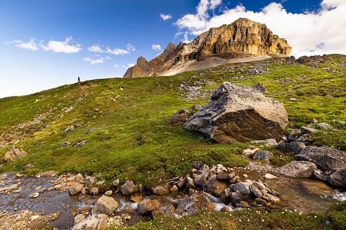
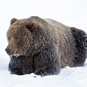

---
# Comment or remove the following two lines if NO references are used
bibliography: [bib/sample.bib, bib/packages.bib]  # Path to bibliography files
csl: bib/the-journal-of-wildlife-management.csl   # Path to reference style file

# Settings for rendering the document
output: 
  akrreport::word_doc:
    toc: false
---

```{r setup, include = FALSE}
# settings --> keep this chunk as it is!
knitr::opts_chunk$set(echo = FALSE, 
                      message = FALSE, 
                      warning = FALSE, 
                      error = FALSE, 
                      fig.path ='figs/')
```

```{r load-packages, include = FALSE}
# Load required packages
library(knitr)
library(flextable)
```

```{r generate-package-refs, include=FALSE}
# Automatically create a bib database for R packages used above
knitr::write_bib(
  x = c(.packages(), 'bookdown', 'rmarkdown', 'akrreport',
    # Add here all packages that are loaded in the above 'load-packages' chunk
    'knitr'), 
  file = 'bib/packages.bib')
```
  
<!-- Cover banner -->
::: {custom-style="CoverPhoto"}
| 
:::
<!-- Cover banner -->

  
<!-- Report Number -->
::: {custom-style="ReportNumber"}
| Alaska Refuge Report YYYY-REPORT # {ReportNumber}
:::
<!-- Report Number -->

<br>

<!-- Title -->
::: {custom-style="Title"}
| Report title
| up to three lines
| long
:::
<!-- Title -->

<br>

<!-- Author -->
::: {custom-style="Author"}
| Author1, Author2, Author3
:::
<!-- Author -->

<br>

<!-- Cover photo -->
::: {custom-style="CoverPhoto"}
| 
:::
<!-- Cover photo -->

<br>

<!-- Report info -->
<!-- ::: {custom-style="ReportInfo"} -->
<!-- | PRIMR #: {PRIMR #} -->
<!-- | ServCat Reference #: {ServCat #} -->
<!-- | {Refuge Name} -->
<!-- | {Month Year} -->
<!-- ::: -->
<!-- Report info -->


<!-- Refuge logo -->
::: {custom-style="CoverPhoto"}
| 
:::
<!-- Refuge logo -->

<br>
<br>

The Alaska Refuge Report Series is used to disseminate information and analysis about natural resources and related topics concerning lands managed by the National Wildlife Refuge System in Alaska. The series supports the advancement of science and informed decision-making by publishing scientific findings that may be ongoing or too limited for journal publication but provide valuable information or interpretations to the field of study. 

<br>

Manuscripts in the series receive an appropriate level of peer review to ensure that the information is scientifically credible, technically accurate, appropriately written for the intended audience, and designed and published in a professional manner. 

<br>

Disclaimer: The use of trade names of commercial products in this report does not constitute endorsement or recommendation for use by the federal government.

<br>

How to cite this report:
LastName, F., N. LastName, and I. LastName. Year. Full report title in sentence case. Alaska Refuge Report
YYYY-REPORT#. https://doi.org/{UNIQUEDOI}.

<br>  
<br>  
<br>  
<br>  
<br>  
<br> 
<br>  
<br>  
<br>  
<br> 
<br>  
<br>  
<br> 
<br> 
<br> 

ON THE COVER  
Image caption goes here  
Image credit goes here 


<!-- Add page break -->

\newpage


## Abstract

Limit to 300 words. This is a formatted template for the Alaska Refuges Report Series. Ideally, the text body, headers, margins, headers and footers are all ready, and the authors need only insert the appropriate text and figures into the template. It is recommended that authors save this template separately before editing. Formatting can easily be changed or deleted during report entry. Edit the headings and subheadings as appropriate for your manuscript. For example, protocols will have different sections than a report. Before finalizing your report for peer review in accordance with the Alaska Refuge Report Series Peer Review guidance, contact an Associate Editor for a report series number, and enter it into the cover and header.


## Keywords

Species names, locations, methods, analysis, interpretations (*alphabetical order*)

######## 

<br><br><br>

Introductory text, background material, appropriate literature review, and survey objectives. For literature citations throughout, use format (author date).

The default format for text body is double-spaced between paragraphs and single-space in the body of a paragraph. Do not indent the first line of a paragraph. Text is left-justified.


# Study Area

A description of the study area. Maps or figures are recommended. Include a compass arrow, legend, and scale bar in maps.


# Methods

## YAML header

Configure the YAML header including the following elements:

-   *bibliography*: A path to the bibliography file to use for references (BibTeX *.bib* file). The current file includes 3 dummy references; either insert your references into this file or replace the file with your own.
-   *csl*: The style is provided in the 'the-journal-of-wildlife-management.csl' file, which adopts the [Journal of Wildlife Management](https://wildlife.onlinelibrary.wiley.com/hub/journal/19372817/forauthors.html) reference style. Just leave the file as it is.
-   *output*: The nested fields for the output field are based on the arguments of the output function. Since *akrreport::word_doc* is based on *bookdown::word_document2*, see its help page for more options. Current default settings are
    -   *toc: FALSE*
    -   *toc_depth: 4*
    -   *number_sections: FALSE*
    -   *highlight: "default"*
    -   *reference_docx: "akrreport-template"*
    -   *font: "Univers Condensed"*
    -   *dpi: 144*

By default *akrreport::word_doc* uses a 'akrreport-template.docx' template file, which is based on standard template file for the Alaska Refuge Report Series except for the font type, which is by default 'Univers Condensed'.

If you feel like using your own template or the standard Word template (i.e. the Normal.doc file), you will need to provide the path to your file or write "default" for the latter case (*reference_docx: "default"*). For further options see also the documentation of the *bookdown::word_document2* function, which is called internally by *akrreport:word_doc*.

## The officedown package

If you are new to working with [officedown](https://davidgohel.github.io/officedown/), [bookdown](https://bookdown.org/), or even [rmarkdown](https://rmarkdown.rstudio.com/), please read over their documentation. To learn more about the `officedown`, `bookdown`, and `rmarkdown` packages in general:

-   [R Markdown: The Definitive Guide](https://bookdown.org/yihui/rmarkdown/) by Yihui Xie, J. J. Allaire, and Garrett Grolemund
-   [bookdown: Authoring Books and Technical Documents with R Markdown](https://bookdown.org/yihui/bookdown/) by Yihui Xie
-   [officeverse guidance](https://ardata-fr.github.io/officeverse/officedown-for-word.html) by David Gohel

## Cross-references

External images and R figures can be referenced with '\@ref(fig:<label>)', where '<label>' is the name of the code chunk. These label names should **not contain underscores** to separate words, use hyphens instead. Note that figures need to have a caption to be numbered and for cross-referencing. The caption is also set in the chunk option with 'fig.cap="Your caption"'.

Cross-references to individual sections can simply be made by placing the name of the section into squared brackets, e.g. a link to the [Figures] is made via '[Figures]'.

Tables also require a label and caption for cross-referencing like figures. The cross-reference for a table, however, contains 'tab:' in '\@ref(tab:<name>)') instead of 'fig:'. Also, table captions produced with R cannot be set in the chunk options like they are for figures. Instead, table captions should be defined in the R function directly (see examples in [Results]). This is a cross-reference to table \@ref(tab:kable1) in the [Using the `knitr` package] chapter.

## Mathematical equations

Use mathematics as usual with the dollar sign `$` at the beginning and end of the equation; either in **inline mode** with a single dollar sign such as $E = mc^2$ or in **display mode** with two dollar signs: $$E = mc^2$$

**Note**: do not leave a space between the '\$' and your mathematical notation.

Alternatively, you can use LaTeX for more control and when equations are more complex. LaTeX equations are also automatically numbered when you define a label within the equation environment, which is useful if you have many equations and want to cross-reference them. The equation label needs to be written with '#eq:label' before the end of the equation (see eq. \@ref(eq:mean)):

\begin{equation}
  \bar{X} = \frac{\sum_{i=1}^n X_i}{n}
  (\#eq:mean)
\end{equation}

Formulas and corresponding explanations should be integrated into the sentence and end with a comma or period. For example:

If the random variable $Y$ follows a standard normal distribution, i.e. $Y \sim N(0,1)$, it's density function can be described with

\begin{equation}
  f_{Y}(y)=\varphi(y) \stackrel{\mathrm{def}}{=} \frac{1}{\sqrt{2 \pi}} \exp \left\{ -\frac{y^2}{2} \right\}, y \in \mathbb{R}.
  (\#eq:density-norm)
\end{equation}


$\pi$ represents the circle number or Ludolph's number. The function

\begin{equation}
  F_{Y}(y)=\Phi(y) \stackrel{\mathrm{def}}{=} \int_{-\infty}^y \varphi(x) \,\mathrm{d}x, \quad y \in \mathbb{R}
  (\#eq:dist-func)
\end{equation}

represents then the distribution function of \@ref(eq:density-norm).

The numbering of equations, as in \@ref(eq:density-norm), need only be done if they are referred to in the text.

## Field methods

A description of the field methods used to collect data.

## Data analysis

A description of the statistical methods and software used to analyze data. The following is recommended language to recognize R and associated packages used for an analysis:

All analyses were performed using the statistical software R (version `r paste(R.Version()$major, R.Version()$minor, sep = ".")`) [@R-base]. This report, including tables, was generated using the packages 'bookdown' (version `r packageVersion("bookdown")`) [@R-bookdown], 'rmarkdown' (version `r packageVersion("rmarkdown")`) [@R-rmarkdown], 'akrreport' (version `r packageVersion("akrreport")`) [@R-akrreport], and 'knitr' (version `r packageVersion("knitr")`) [@R-knitr].


# Results

## R output

R output is typically shown in the monospace font (here an example with the `iris` dataset):

```{r}
summary(iris[,1:3])
```

## Tables

If the output format is Word tables are generated best using R packages instead of R Markdown syntax. The following two sections demonstrate some useful packages.

### Using the `knitr` package

Table \@ref(tab:kable1) is an example of using `knitr::kable()` to generate the table. The function has an explicit argument named 'caption' where you can place your caption text.

```{r kable1, ft.align="left"}
df <- mtcars[1:5, 1:6]

set_flextable_defaults(font.family = "Univers Condensed Light")
flextable::regulartable(df) |>
  set_caption("Table Caption") |>
  autofit()
```

## Figures

Figures can directly be produced with R and displayed here. Similar to external images, figure captions and labels are placed inside the chunk options for cross-referencing (see Fig. \@ref(fig:base-fig)).

```{r base-fig, fig.cap = "Relationship between horsepower and fuel economy."}
plot(mtcars$hp, mtcars$mpg,
xlab = "Gross Horsepower",
ylab = "Miles Per Gallon",
pch = 19)
abline(lm(mpg ~ hp, data = mtcars), col = "red")
```

You can also include images (Fig. \@ref(fig:bear-fig)).

```{r bear-fig, fig.cap = "Here's a picture of a bear in Alaska.", fig.asp= 1, fig.width=2}

```


# Discussion

## Adding citations and bibliography

Link a `.bib` document via the YAML header, and the bibliogaphy will be printed at the very end (as usual). The default bibliography style is provided in the `the-journal-of-wildlife-management.csl` file, which adopts the [Journal of Wildlife Management](https://www.nacwg.org/JWMguidelines2011.pdf) reference style.

References can be cited directly within the document using the R Markdown equivalent of the LaTeX citation system `[@key]`, where key is the citation key in the first line of the entry in the .bib file. Example: [\@fws2001]. To cite multiple entries, separate the keys by semicolons (e.g., [@paul2009; @buckland1997]).

If you are using the reference manager [Zotero](https://www.zotero.org/) (recommended), then Rstudio can [access your reference library directly](https://bookdown.org/pdr_higgins/rmrwr/adding-citations-to-your-rmarkdown.html). Zotero is available through FWS Apps-2-Go. 
There is also the package [citr](https://github.com/crsh/citr). *citr* provides functions and an RStudio add-in to search a BibTeX-file to create and insert formatted Markdown citations into the current document.


# Acknowledgements

Include your appreciation of logistical support, funding sources, field technicians, managers, and others who contributed to the work.


# Data availability

All the raw data used in your report should be publicly-accessible, unless legally exempt (e.g., [FOIA-exempt](https://www.fws.gov/program/fws-freedom-information-act-foia)) Recommended boilerplate language for this section could read "The data presented in this report are available at {your data's ServCat URL}".

<!-- Add page break -->

\newpage


# References

<!-- All references will be added here automatically. -->
